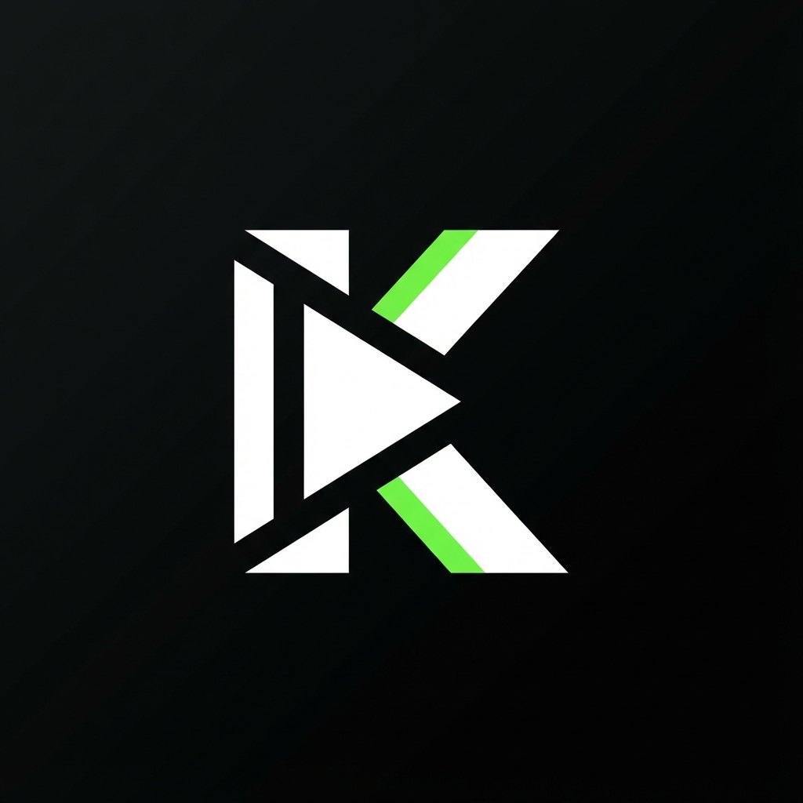

# Kelle KickClient

<p align="center">
  
</p>

A specialized desktop client for [Kick.com](https://kick.com) with live DVR recording, VOD downloading, and dynamic theming capabilities.

## ✨ Features

- **🔴 Live DVR Recording** - Record live streams in real-time with quality selection
- **📥 VOD Downloading** - Download past broadcasts and clips
- **🎨 Dynamic Theming** - Customizable text watermark overlay
- **🔌 Seamless Integration** - Native-looking controls injected into Kick's player
- **🔄 Auto-Reconnect** - Automatic reconnection on stream drops

## 🚀 Quick Start

### Prerequisites

- [Node.js](https://nodejs.org/) (v18 or later)
- [FFmpeg](https://ffmpeg.org/) installed and accessible in PATH

### Installation

```bash
# Clone the repository
git clone https://github.com/YOUR_USERNAME/kelle-kickclient.git
cd kelle-kickclient

# Install dependencies
npm install

# Start the application
npm start
```

### Building

```bash
# Build for Windows (Portable)
npm run build:win

# Build for macOS
npm run build:mac

# Build for Linux
npm run build:linux
```

Built executables will be in the `dist/` folder.

## 🎮 Usage

1. Launch the application
2. Navigate to any Kick.com channel
3. Click the **Record** button in the player controls
4. Select your desired quality
5. Recording will be saved to your Downloads folder

### Settings

Click the ⚙️ button in the bottom-right corner to customize:
- Watermark text overlay

## 🏗️ Project Structure

```
kelle-kickclient/
├── main.js          # Electron main process
├── preload.js       # IPC bridge and UI injection
├── renderer.js      # UI logic and theming
├── styles.css       # Custom styles
├── assets/
│   └── icon.png     # Application icon
└── package.json     # Project configuration
```

## 🛠️ Technologies

- **Electron** - Desktop application framework
- **fluent-ffmpeg** - FFmpeg wrapper for Node.js
- **electron-builder** - Build and distribute Electron apps

## 📝 License

MIT License - see [LICENSE](LICENSE) for details.

## 🤝 Contributing

Contributions are welcome! Please feel free to submit a Pull Request.

---

<p align="center">Made with 💚 by kelle</p>
